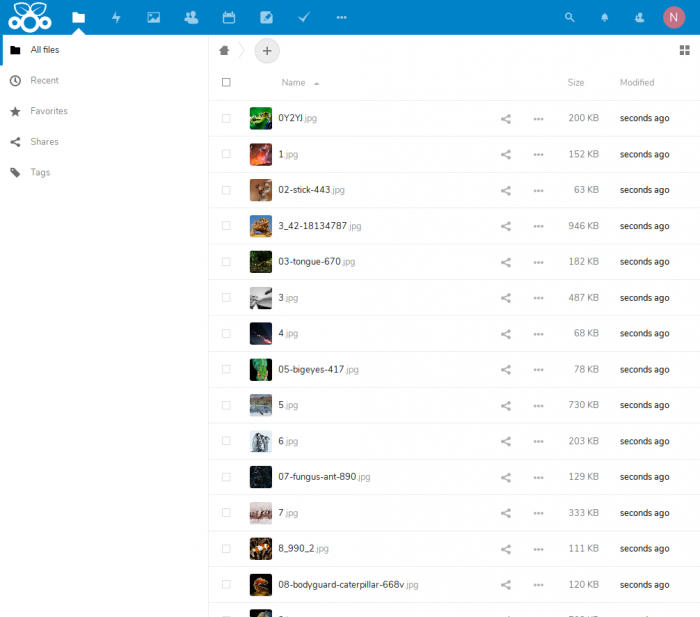

# Adding a cron job without crontab
You can directly edit the following files:

```text-plain
/etc/crontab
/etc/cron.d/*
/etc/cron.{hourly,daily,weekly,monthly}/*
```

These are system-wide files. In these files you must specify a username before the command to be executed.

In contrast, per-user crontabs are stored here: `/var/spool/cron/<username>`

